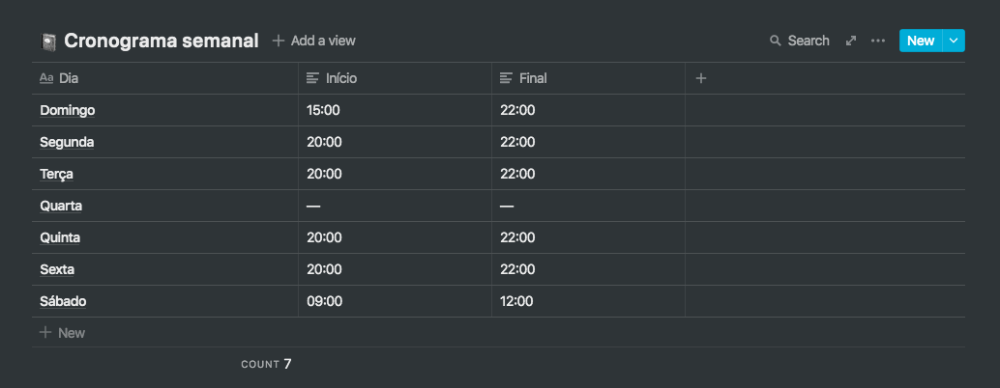
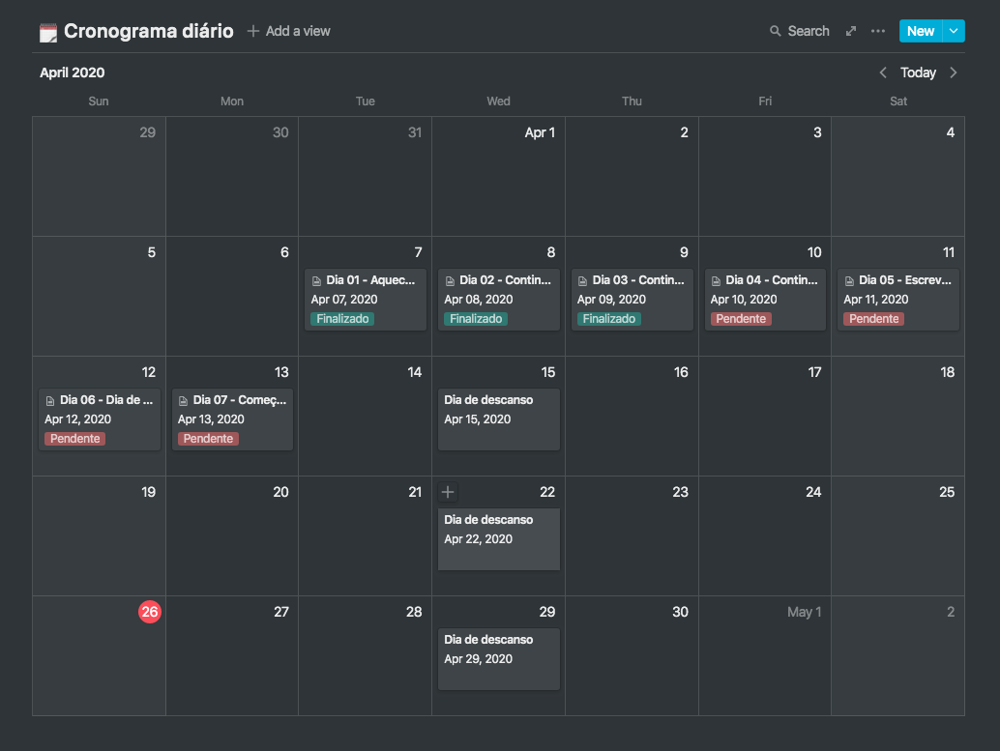

<h1 align="center">
  
</h1>

<h3 align="center">
  Desafio 1: Planejando meus estudos
</h3>

  Desafio desenvolvido durante o <a href="https://rocketseat.com.br/gostack">Bootcamp GoStack</a> da Rocketseat.

## Sobre o desafio

Nesse desafio, eu precisei planejar meus estudos.

Para isso, criei um cronograma que adaptei ao meu tempo e ritmo, definindo qual horário de estudo. Criei tarefas que estão atreladas a um calendário, para me manter em foco e sempre alinhado aos objetivos!

### Cronograma semanal

Nessa seção eu informei horários fixos que irei me dedicar durante minha jornada. Afinal, uma rotina de estudos é o primeiro passo para conseguir atingir os objetivos.

  

### Cronograma diário

Nessa seção eu planejei minhas tarefas diárias, para estar preparado para todo o conteúdo que será disponibilizado.

  

Aos poucos vou adicionar conteúdo extra, como leituras e podcasts, além de tirar um tempo para criação de conteúdo como posts no meu blog pessoal ou LinkedIn.

## Licença

Esse projeto está sob a licença MIT.

---

Made with ♥️ by Adeonir Kohl